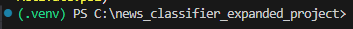

# 뉴스 수집 및 분류기

Python 기반 뉴스 수집 및 분류기 프로젝트입니다.

Google News RSS에서 키워드 기반 뉴스를 수집하고, Hugging Face zero-shot 분류 모델과 규칙 기반 보정 로직을 활용하여 뉴스 카테고리를 분류합니다.  
분류 결과는 CSV 파일로 저장하여 Excel로 확인할 수 있고, SQLite DB에 누적 저장하여 필요할 때 다시 조회할 수 있습니다.


---

## 주요 기능

- Google News RSS 기반 뉴스 수집
- 뉴스 제목 및 설명 텍스트 전처리
- 중복 뉴스 제거
- Hugging Face zero-shot 분류 모델 기반 1차 분류
- 모델 점수와 top1-top2 margin 기반 신뢰도 판단
- 규칙 기반 키워드 보정
- 최종 카테고리, 신뢰도, 보정 여부 저장
- CSV 결과 저장
- SQLite 누적 저장
- 카테고리별 기사 수 요약 출력
- 낮은 신뢰도 기사 재검토 가능

---

## 사용 기술

- Python
- Google News RSS
- Hugging Face Transformers
- Zero-shot Classification
- Pandas
- BeautifulSoup
- SQLite
- CSV
- Pytest

---

## 프로젝트 구조

```text
news_classifier_expanded/
├─ README.md
├─ requirements.txt
├─ pyproject.toml
├─ .env.example
├─ ARCHITECTURE.md
├─ LINE_COUNTS.json
│
├─ src/
│  └─ news_classifier/
│     ├─ cli.py
│     ├─ pipeline.py
│     ├─ service.py
│     ├─ config.py
│     ├─ models.py
│     ├─ scheduler.py
│     ├─ dashboard_streamlit.py
│     │
│     ├─ collectors/
│     ├─ classifiers/
│     ├─ dedup/
│     ├─ features/
│     ├─ storage/
│     ├─ exporters/
│     ├─ reporting/
│     ├─ rules/
│     └─ utils/
│
├─ tests/
├─ data/
└─ scripts/
```

---

## 주요 파일 설명

| 파일 | 설명 |
|---|---|
| `src/news_classifier/cli.py` | 터미널 명령어 해석 및 뉴스 수집·분류 실행 진입점 |
| `src/news_classifier/service.py` | 수집기, 분류기, 규칙 엔진, 중복 제거기 조립 및 파이프라인 구성 |
| `src/news_classifier/pipeline.py` | 뉴스 수집, 중복 제거, 분류, 후처리까지의 전체 처리 흐름 실행 |
| `src/news_classifier/collectors/google_rss.py` | Google News RSS 기반 키워드 뉴스 수집 및 기사 정보 추출 |
| `src/news_classifier/collectors/article_scraper.py` | 선택적 기사 본문 추가 수집 및 분류 입력 데이터 보강 |
| `src/news_classifier/classifiers/zero_shot_classifier.py` | Hugging Face zero-shot 모델 기반 뉴스 1차 카테고리 분류 |
| `src/news_classifier/classifiers/rule_engine.py` | 카테고리별 키워드 매칭 점수 계산 및 규칙 기반 보정 근거 생성 |
| `src/news_classifier/classifiers/postprocessor.py` | 모델 점수, margin, 규칙 점수 기반 최종 카테고리 결정 |
| `src/news_classifier/rules/default_rules.py` | 기본 분류 카테고리 및 키워드 규칙 사전 관리 |
| `src/news_classifier/rules/extended_rules.py` | 확장 키워드 기반 규칙 데이터 제공 |
| `src/news_classifier/models.py` | 뉴스 기사, 모델 예측값, 규칙 판단 결과 등 공통 데이터 구조 정의 |
| `src/news_classifier/storage/csv_store.py` | 분류 결과 CSV 저장 및 Excel 확인용 파일 생성 |
| `src/news_classifier/storage/sqlite_store.py` | 분류 결과 SQLite DB 누적 저장 및 재조회 지원 |
| `src/news_classifier/reporting/summary_report.py` | 전체 기사 수, 낮은 신뢰도 기사 수, 규칙 보정 수, 카테고리별 개수 요약 출력 |
| `src/news_classifier/config.py` | 모델명, 분류 라벨, 임계값 등 프로젝트 설정값 관리 |
| `src/news_classifier/utils/http.py` | RSS 요청 등 HTTP 통신 공통 기능 제공 |
| `src/news_classifier/utils/text.py` | HTML 제거, 공백 정리, 텍스트 정규화 등 전처리 기능 제공 |
| `tests/` | 전처리, 중복 제거, 규칙 보정, 파이프라인 동작 검증용 테스트 코드 |
| `data/` | 분류 규칙 및 테스트 검증용 샘플 뉴스 데이터 |
| `scripts/` | 프로젝트 실행 보조 스크립트 관리 |

---

## 실행 환경

- Python 3.12 이상 권장
- Windows PowerShell 기준
- VS Code 터미널 기준

---

## 실행 방법

### 1. 프로젝트 폴더로 이동

```powershell
cd C:\news_classifier_expanded_project
ls
```

`requirements.txt`, `src`, `tests`, `data` 폴더 확인

---

### 2. 가상환경 생성 및 활성화



- 가상환경 생성 및 활성화
  - 실제 프로젝트 폴더 위치 확인 → 패키지 설치 → Python 경로 설정 → 실행
  - 종료: deactivate
```powershell
cd C:\news_classifier_expanded_project\news_classifier_expanded
..\.venv\Scripts\Activate.ps1
```

정상 활성화 시 터미널 앞 `(.venv)` 표시

---

### 3. 패키지 설치

```powershell
python -m pip install --upgrade pip
python -m pip install -r requirements.txt
```

설치했으면 스킵

---

### 4. Python 경로 설정

```powershell
$env:PYTHONPATH="src"
```

`src` 폴더 안의 `news_classifier` 패키지 인식 설정

---

### 5. CSV 파일로 결과 저장

```powershell
python -m news_classifier.cli collect --keyword "AI 반도체" --limit 10 --csv out.csv
```

실행 후 `out.csv` 파일 생성  
CSV 파일을 Excel로 열어 결과 확인 가능

```powershell
ii .\out.csv
```

---

### 6. CSV와 SQLite에 동시에 저장

```powershell
python -m news_classifier.cli collect --keyword "AI 반도체" --limit 10 --csv out.csv --sqlite news.db
```

실행 후 `out.csv`, `news.db` 파일 생성

| 파일 | 용도 |
|---|---|
| `out.csv` | Excel 기반 결과 확인 |
| `news.db` | SQLite 기반 누적 저장 및 재조회 |

---

## 다른 키워드로 실행하기

키워드를 바꾸면 다른 주제의 뉴스도 수집할 수 있습니다.

```powershell
python -m news_classifier.cli collect --keyword "생성형 AI" --limit 10 --csv generative_ai.csv --sqlite news.db
```

```powershell
python -m news_classifier.cli collect --keyword "반도체 공급망" --limit 10 --csv semiconductor_supply.csv --sqlite news.db
```

SQLite 파일명을 동일하게 `news.db`로 지정하면 여러 키워드의 결과를 하나의 DB에 누적 저장할 수 있습니다.

---

## SQLite 저장 결과 확인

최근 저장된 뉴스 20개를 터미널에서 확인합니다.

```powershell
python -c "import sqlite3, pandas as pd; conn=sqlite3.connect('news.db'); df=pd.read_sql_query('SELECT title, source, final_category, confidence_level, rule_applied, published_at FROM classified_news ORDER BY id DESC LIMIT 20', conn); print(df.to_string(index=False))"
```

카테고리별 기사 수를 확인합니다.

```powershell
python -c "import sqlite3, pandas as pd; conn=sqlite3.connect('news.db'); df=pd.read_sql_query('SELECT final_category, COUNT(*) AS count FROM classified_news GROUP BY final_category ORDER BY count DESC', conn); print(df.to_string(index=False))"
```

낮은 신뢰도 기사만 확인합니다.

```powershell
python -c "import sqlite3, pandas as pd; conn=sqlite3.connect('news.db'); df=pd.read_sql_query(\"SELECT title, source, final_category, confidence_level, rule_reason FROM classified_news WHERE confidence_level='낮음' ORDER BY id DESC LIMIT 20\", conn); print(df.to_string(index=False))"
```

---

## 실행 예시

```powershell
cd C:\news_classifier_expanded_project\news_classifier_expanded
Set-ExecutionPolicy -Scope Process -ExecutionPolicy RemoteSigned
.\.venv\Scripts\Activate.ps1
python -m pip install --upgrade pip
python -m pip install -r requirements.txt
$env:PYTHONPATH="src"
python -m news_classifier.cli collect --keyword "AI 반도체" --limit 10 --csv out.csv --sqlite news.db
```

실행 결과 예시는 다음과 같습니다.

```text
CSV saved: out.csv

# 뉴스 분류 요약
- 전체 기사 수: 10
- 낮은 신뢰도 기사 수: 2
- 규칙 보정 적용 기사 수: 1

## 카테고리별 기사 수
- 기술개발: 8
- 기업동향: 1
- 시장/투자: 1
```

## 전체 처리 과정

1. 사용자가 터미널에서 키워드와 저장 옵션을 입력합니다.
2. cli.py가 명령어를 해석합니다.
3. service.py가 수집기, 분류기, 규칙 엔진, 저장소 객체를 조립합니다.
4. pipeline.py가 전체 처리 흐름을 실행합니다.
5. google_rss.py가 Google News RSS에서 뉴스를 수집합니다.
6. 중복 뉴스 제거 후 필요하면 article_scraper.py로 본문을 보강합니다.
7. zero_shot_classifier.py가 Hugging Face 모델로 1차 분류를 수행합니다.
8. rule_engine.py와 postprocessor.py가 모델 점수, margin, 키워드 규칙을 바탕으로 최종 카테고리를 결정합니다.
9. csv_store.py와 sqlite_store.py가 결과를 CSV 또는 SQLite에 저장합니다.

## GitHub 업로드

```powershell
git init
git add .
git status
git commit -m "뉴스 수집 및 분류기 프로젝트 초기 커밋"
git branch -M main
git remote add origin https://github.com/Yang0Jin0Woo/news-collection-classification_python.git
git push -u origin main
```

## 프로젝트 개선 내용

초기 버전은 단일 Python 스크립트에서 뉴스 수집, 분류, 규칙 보정, CSV 저장을 처리하는 구조였습니다.

이후 수집기, 분류기, 규칙 보정, 저장소, 리포트, 테스트 코드, 샘플 뉴스 데이터로 기능을 분리했습니다. 또한 SQLite 저장 기능을 추가하여 뉴스 분류 결과의 누적 저장 및 재조회가 가능하도록 개선했습니다.

주요 개선 사항은 다음과 같습니다.

- 단일 스크립트에서 모듈형 프로젝트 구조로 개선
- Google News RSS 수집 로직 분리
- zero-shot 분류 모델 처리 로직 분리
- 모델 점수와 margin 기반 신뢰도 판단 추가
- 카테고리별 키워드 규칙 사전 확장
- 규칙 기반 키워드 보정 로직 강화
- CSV 저장과 SQLite 누적 저장 기능 분리
- 최종 카테고리, 신뢰도, 규칙 보정 여부 저장
- 낮은 신뢰도 기사 재검토 기능 추가
- 카테고리별 기사 수 요약 조회 기능 추가
- 전처리, 중복 제거, 규칙 보정, 파이프라인 검증 테스트 추가
- 카테고리별 샘플 뉴스 케이스 추가
