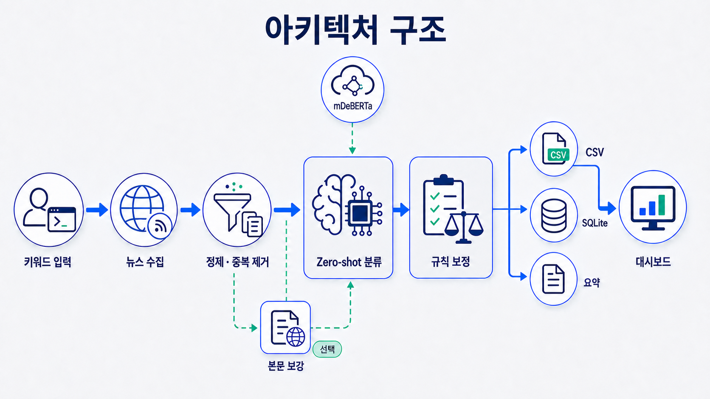
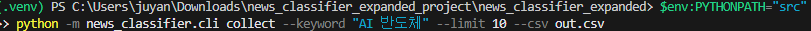
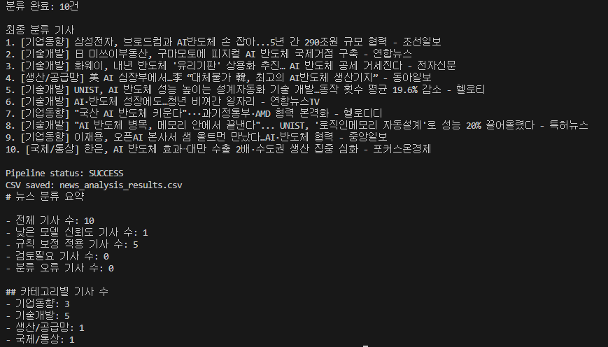

# 뉴소트(NewSort)

검색어로 뉴스를 자동 수집하고, 다국어 AI와 보정 규칙으로 경제, 산업과 일반 뉴스의 17개 주제에 분류하는 Python 기반 뉴스 분석 프로젝트.
분류 결과와 판단 근거의 CSV 저장, 대시보드 시각화, 터미널에서 실행 성공과 오류 구분.

## 핵심 기능

- **수집과 정제:** Google News RSS의 최근 7일 뉴스 수집, 제목 정리, 완전 중복 및 동일 사건의 유사 기사 묶기
- **AI 분류:** 사전학습 모델 mDeBERTa와 사건 중심 주제 설명을 이용한 별도 추가 학습 없는 분류
- **규칙 기반 판단:** 모델 예측 점수와 상위 두 주제의 점수 차이, 기사 속 키워드 근거 비교를 통한 최종 판단
- **규칙 오탐 개선:** 단어 경계 확인, 긴 구문 우선, 중복 가산 방지, 분야명과 고유명사의 점수 제외, 강한 근거 2점과 일반 근거 1점 적용
- **결과 관리:** CSV 저장과 Streamlit 대시보드 조회, 선택적 SQLite 누적 저장

분류 주제: 기술개발, 제품/서비스, 기업동향, 생산/공급망, 정책/규제, 금융/투자, 시장/산업, 노동/노사, 국제/통상, 교육/취업, 사회, 정치, 문화/연예, 스포츠, 건강/의료, 생활/환경, 기타/무관.

새 일반 뉴스 주제는 모델 판단으로 분류, 사람이 확인한 오류 근거가 없는 새 키워드 규칙의 임의 추가 없음.
정책/규제는 정부 정책과 법률, 정치는 정당과 선거 중심 구분. 교육/취업은 입시와 교육, 직업 훈련과 구직, 노동/노사는 임금과 근로 조건 및 노사 갈등 중심 구분.

사용 기술: Python, PyTorch, Transformers, Pandas, BeautifulSoup, Streamlit, SQLite, Pytest.

## 처리 흐름

검색어 입력 → RSS 수집 → 정제와 중복 제거 → AI 분류 → 규칙 기반 최종 판단 → CSV 저장과 결과 확인.
기사 본문 보강과 SQLite 저장은 선택 기능.



## 실행 방법

실행 환경: Python 3.11~3.13, 뉴스 수집과 최초 모델 다운로드를 위한 인터넷 연결.
아래 명령은 Windows PowerShell 기준이며, 최초 분류 시 모델 다운로드와 로딩 시간 소요 가능.

### 1. 프로젝트 폴더 이동

작업 위치: `pyproject.toml`이 있는 `news_classifier_expanded` 폴더.
상위 폴더에서 시작한 경우 아래 명령으로 이동, 이미 해당 폴더인 경우 생략.

```powershell
cd .\news_classifier_expanded
```

### 2. 가상환경 생성과 설치

가상환경: 다른 Python 프로젝트와 사용 패키지를 분리하는 실행 공간.

```powershell
python -m venv .venv
.\.venv\Scripts\Activate.ps1
python -m pip install -e .
```

macOS와 Linux에서는 활성화 명령을 `source .venv/bin/activate`로 대체.
기본 실행은 `.env` 파일 생성 없이 가능, 설정 변경 시 `.env.example`을 복사한 `.env` 파일 사용.

### 3. 뉴스 수집과 분류

```powershell
news-classifier collect --keyword "AI 반도체"
```

기본 최대 수집량 10건, 정제와 동일 사건 묶기 후 대표 기사 수 감소 가능. 공통 단어만 겹치는 서로 다른 기사는 유지.

### 4. 대시보드 확인

```powershell
news-classifier dashboard
```

CSV 결과의 주제별 기사 수, 규칙 적용 수, 검토 필요 기사 확인.
그래프는 최초 모델 예측인 `model_category`가 아닌 최종 판단인 `final_category` 기준 집계, 실제 결과에 있는 주제만 표시.
수집 기사 수와 대표 기사 수 구분, `묶인 기사와 원문 링크 보기`에서 다른 언론사의 기사 확인.
대시보드 종료는 실행한 터미널에서 `Ctrl+C` 입력.

### 선택 옵션

| 옵션 | 용도 |
|---|---|
| `--limit 20` | 최대 수집량 지정, 허용 범위 1~100 |
| `--csv result.csv` | CSV 저장 경로 지정 |
| `--sqlite` | SQLite에도 저장, 기본 파일 `news_analysis.db` |
| `--sqlite custom.db` | SQLite 저장 경로 직접 지정 |
| `--enrich-content` | 기사 영역 우선 본문 수집, 메뉴와 반복 문단 제외 시도 |

```powershell
news-classifier collect --keyword "AI 반도체" --limit 20 --sqlite
```

## 실행 예시

검색어 입력과 수집 명령 예시.



기사별 분류 결과, 실행 상태, CSV 저장 경로와 처리 건수의 터미널 출력 예시.
검색 시점과 기사 내용에 따른 결과 변동 가능. 아래 사진은 이전 주제 체계의 실행 예시이며, 최신 17개 주제 결과는 재수집 후 확인.



## 결과 읽는 방법

- **CSV:** 기본 파일 `news_analysis_results.csv`, Excel에서 열기 가능, 실행마다 해당 파일의 결과 교체
- **SQLite:** 옵션 지정 시 결과 누적 보관, 같은 검색어와 제목 및 언론사의 기사는 기존 항목 갱신
- **대시보드:** CSV에 저장된 기사별 결과 조회용 화면, 전체 실행 성공과 실패는 터미널에서 확인

`decision_source`는 최종 판단의 출처이며, 정상 실행에서 사용하는 판정 경로는 아래 3종.

| 값 | 의미 |
|---|---|
| `MODEL` | 모델 예측 유지 |
| `RULE` | 규칙 근거로 최종 주제 결정 |
| `REVIEW` | 모델 판단도 불확실하고 규칙 근거도 부족하여 사람 검토 필요 |

`final_category`는 최종 주제 또는 검토필요 상태, `rule_reason`은 보정이나 검토 판단의 이유.
검토 사유는 `근거 없음`, `규칙 점수 부족`, `주제 간 점수 차이 부족`으로 구분. 여러 조건이 부족한 경우 근거 없음, 총점 부족, 점수 차이 부족 순서로 우선 표시.
`model_confidence`는 원래 모델 예측의 참고 점수이며, 규칙 적용 후 최종 주제의 정답 확률을 보장하는 값은 아님.

`group_article_count`는 대표를 포함한 묶음 기사 수, `related_articles`는 다른 기사들의 제목, 언론사, 발행일과 원문 링크를 보존한 JSON 목록. 분류 입력에는 대표 기사의 내용만 사용.
터미널과 대시보드의 카테고리 통계 및 검토 수는 대표 기사 기준. 대표는 수집 순서상 첫 기사이며, 모델 점수에 따른 대표 선택 없음.

- **정상 분류 또는 검색 결과 0건:** 종료 코드 `0`, 0건이면 열 이름(헤더)만 있는 CSV 저장
- **수집 또는 모델 오류:** 오류 메시지 출력, 실패한 실행 결과의 저장 중단, 종료 코드 `1`
- **입력 기사 수와 모델 출력 수 불일치:** 모델 오류 처리로 기사 누락 결과의 정상 저장 방지

## 주요 코드 위치

| 경로 | 역할 |
|---|---|
| `src/news_classifier/cli.py` | 터미널 명령과 실행 옵션 처리 |
| `src/news_classifier/pipeline.py` | 수집부터 최종 판단까지의 전체 흐름과 실행 상태 관리 |
| `src/news_classifier/collectors/` | RSS 수집과 선택적 본문 보강 |
| `src/news_classifier/classifiers/`, `src/news_classifier/rules/` | AI 분류, 규칙 근거 계산과 최종 판단 |
| `src/news_classifier/storage/` | CSV와 SQLite 저장 |
| `src/news_classifier/dashboard_streamlit.py` | CSV 결과 시각화 |
| `tests/`, `scripts/` | 자동 테스트, 실제 뉴스 평가와 신뢰도 기준 보정 도구 |

## 검증과 한계

```powershell
python -m pytest -q
```

- 자동 테스트를 통한 정제, 중복 제거, 규칙 판단, 실패 처리와 저장 동작 검증
- 사람이 확정한 정답을 이용한 모델 단독, 규칙 단독, 두 방식 조합의 비교 평가 기능 구현
- 현재 실제 뉴스 분류 정확도 미검증, 자동 테스트 통과와 실제 정확도는 별개의 검증
- 실제 평가에는 사람이 확정한 정답과 개발용/평가용 데이터 분리 필요, 추천 라벨의 정답 사용 불가
- 기본 분류 입력은 기사 제목과 설명 및 선택적 본문이며, 검색어에 의한 판단 편향 방지를 위해 검색어의 모델 입력 제외
- 제목과 언론사명만 반복하는 설명의 모델 입력 제외, 긴 제목/설명 때문에 본문이 잘리지 않도록 입력 길이 분배. 원본 제목과 설명의 CSV 보존
- 현재 주제 정의에 맞지 않는 뉴스의 기타/무관 또는 검토 처리 필요. 검색어마다 여러 주제의 출현이나 균등 분포를 강제하지 않고 기사 내용에 따른 분류
- 유사 기사 묶기는 제목, 설명, 발행일을 사용하는 보수적인 규칙 기반 추정이며, 실제 동일 사건 여부의 완전한 판별은 미보장. 사이트에 따른 본문 수집 실패 가능

동일 사건 묶기 기준: 최대 48시간 이내 발행, 충분한 제목 길이와 단어 수, 기관명 및 수치의 일치, 상반된 표현 제외. 독립적인 설명이 있는 경우 제목 유사도 0.88 이상과 설명 유사도 0.85 이상 확인. RSS 설명이 제목 반복뿐이거나 설명이 없는 경우 제목 유사도 0.95 이상 적용. 발행일이 없거나 짧은 일반 제목인 경우 언론사 간 자동 묶기 제외.
기준값은 보수적인 초기 설정이며 실제 기사로 추가 검증 필요. 그룹의 모든 기사와 비교하여 연쇄적인 오묶음 방지. 과거 CSV는 묶음 정보가 없으면 각 행을 1건으로 조회, 기존 SQLite는 다음 사용 시 컬럼 추가로 기존 행 보존.

### 규칙 보강 절차

1. 다양한 검색어의 후보 기사 수집과 기존 파일 보존. 검색어별 결과의 순환 선택으로 앞 검색어에만 치우친 표본 방지.
2. 기사 링크와 내용을 사람이 확인한 뒤 `gold_label`에 정답 주제, `reviewed_by`에 검토자, `review_status`에 `confirmed` 기록. 같은 사건의 다른 기사에는 동일한 `event_id` 지정.
3. 규칙 후보 확인에 사용한 기사는 `split=development` 지정. 후보 점검 결과의 제안 주제는 정답으로 간주 불가.
4. 기존 규칙 중복과 다른 주제의 사용 사례 확인 후, 서로 다른 사건 최소 2개와 기존 모델의 오답을 근거로 규칙 추가. 출현 횟수나 구문 길이만으로 강한 근거 확정 금지.
5. 규칙 확정 후 후보 선정에 사용하지 않은 별도 사건의 평가 기사 준비. `split=evaluation` 지정, 각 split에 현재 전체 정답 주제 포함 필요.
6. 동일한 모델 출력으로 추가 규칙 전후의 검토 비율, 자동 결정 정확도, 잘못된 규칙 적용과 정답을 오답으로 변경한 건수 비교. 실제 평가 전 판정 기준값 유지.

```powershell
python scripts/collect_evaluation_news.py --output data/evaluation/new_candidates.csv
python scripts/review_rule_candidates.py --dataset data/evaluation/new_candidates.csv --output data/evaluation/new_candidate_audit.json
# 사람이 정답 확인을 완료한 데이터만 평가 가능
python scripts/evaluate_news.py --dataset data/evaluation/reviewed_news.csv --split development --output-dir evaluation_results/development
python scripts/evaluate_news.py --dataset data/evaluation/reviewed_news.csv --split evaluation --output-dir evaluation_results/evaluation
```

`기타/무관`과 새 일반 뉴스 주제는 직접 키워드 규칙 없이 모델 판단 사용. 스포츠와 문화 등의 기사에 대한 기존 무관 문맥 강제 처리 해제. 후보 CSV에는 정답이나 추천 라벨의 자동 입력 없음.
후보 수집은 경제, 산업과 일반 뉴스 검색어를 같은 방식으로 순환 선택. 스포츠와 문화 뉴스의 별도 부정 표본 취급 제거와 `--negative-total` 옵션 폐지.

### 검색어에 독립적인 분류 개선

검색 분야 대신 기사 중심 사건에 따른 판단. 자동차의 연구는 기술개발, 신차 출시는 제품/서비스, 인수는 기업동향으로 구분하는 공통 기준. AI에만 적용하는 별도 분기 없음.

- 모델 내부의 17개 주제 설명 구체화, 기존 주제명 유지와 일반 뉴스 7개 주제 추가
- GPU, 전고체 배터리 같은 기술 종류와 기업명, 국가명 등 기존 일반 명사의 `context_only` 지정. 기사 내용은 유지, 해당 단어의 규칙 점수 및 근거 수 가산 제외
- 기존 사건 구문과 단어 경계, 긴 구문 우선, MODEL/RULE/REVIEW 경로 및 판정 기준값 유지. 사람 검증 없는 새 사건 규칙 추가 없음
- 기사 영역 우선 추출과 중복 문단 제거. 본문 보강은 선택 기능이며 접근 차단, RSS 연결 페이지 등으로 실패 가능. 본문이 없으면 제목과 유효 설명만 사용

분류 입력 정책과 주제 설명이 바뀌면 모델 점수도 달라질 가능성. 과거 신뢰도 보정 파일의 자동 재사용 차단, 확인된 development 기사로 보정 파일 재생성 필요. 신뢰도 등급 보정과 최종 판정 기준값 변경은 별개의 작업.
모델 점수는 후보 주제 간 상대 점수이며, 주제 확장에 따른 점수 하락과 검토 비율 증가 가능. 주제 범위 확장만으로 검토 비율 감소 보장 불가, 최종 판정 기준 조정에는 사람이 확인한 정답 자료로 별도 검증 필요.

```powershell
# 여러 분야 후보 수집, 정답과 검토자는 사람 확인 후 작성
python scripts/collect_evaluation_news.py --output data/evaluation/event_candidates.csv --enrich-content
# 개발 단계에서 사용하지 않은 검색어만 별도 후보 수집
python scripts/collect_evaluation_news.py --queries-only --query "항공" --query "보험" --target-total 40 --output data/evaluation/unseen_candidates.csv
# 사람이 검토한 development/evaluation 행을 하나의 CSV에 모은 뒤 비교
python scripts/evaluate_news.py --dataset data/evaluation/reviewed_news.csv --split evaluation --compare-legacy --require-unseen-keywords --output-dir evaluation_results/unseen
```

개발용과 평가용 사건 분리 및 각 split의 현재 전체 정답 주제 확보 필요. 기존 10개 주제의 평가 자료만 있는 경우 새 주제의 사람이 확인한 정답 기사 보충 필요. 동일 사건의 대표 기사 1개 평가 권장. `--require-unseen-keywords`는 두 split의 검색어 중복도 차단하며, 새로운 분야에서의 성능을 보장하는 기능은 아님.
`--compare-legacy`는 같은 모델 가중치와 원문으로 초기 10개 짧은 주제명, 이전 원문 입력과 무관 문맥 규칙을 재현하는 비교. 현재 17개 주제 설명과의 비교이며 확장 전 점수의 그대로 재사용 불가. 검색어별 결과, 다른 주제를 기술개발로 오분류한 건수와 비율, 검토 비율, 잘못된 규칙 보정 함께 확인. 기술개발 비중만 감소시키는 목표는 미사용.
기존 CSV와 포트폴리오 PPT 파일의 수정 또는 자동 재분류 없음. 새 주제는 다음 수집부터 적용, 과거 결과는 기존 CSV 기준 조회. 기존 신뢰도 보정 파일은 후보 주제와 설명 불일치로 재사용 차단, 현재 전체 주제를 확인한 development 기사로 재생성 필요.
현재 수정은 동작 검증 단계이며, 사람 정답 자료 부족으로 실제 정확도 향상과 편향 감소 수치 미확정.
